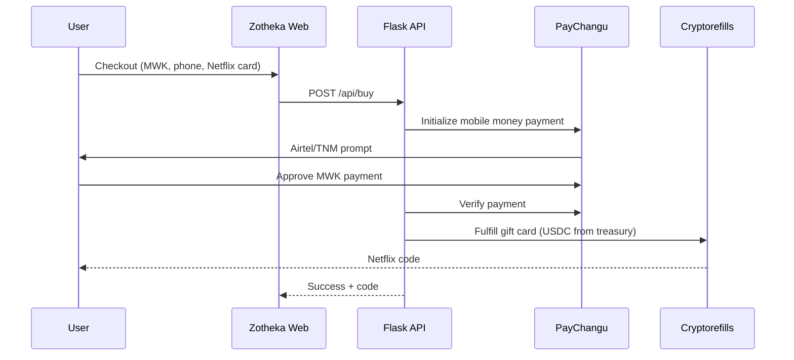
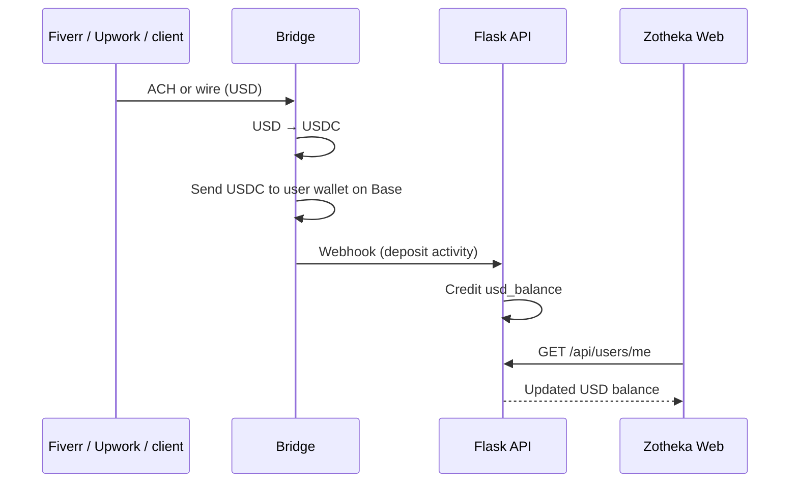
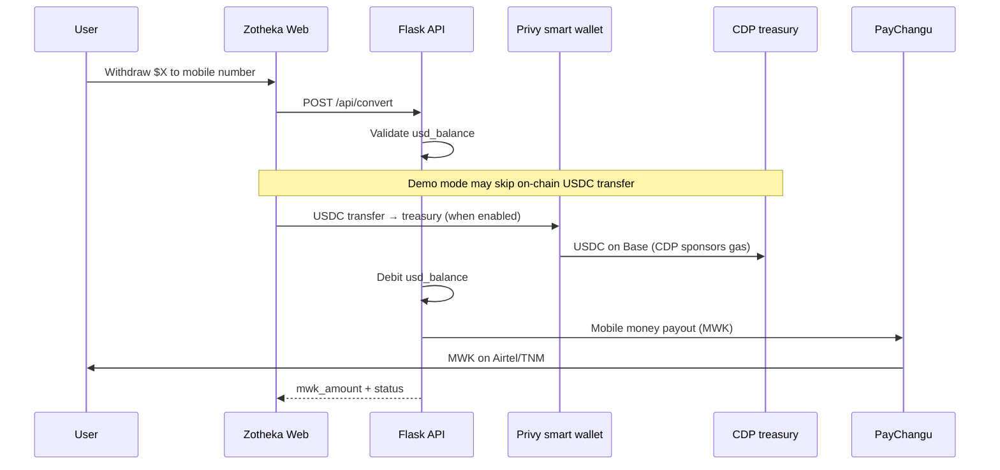

# Zotheka Web

Public-facing web experience for **Zotheka**: a Malawi-focused payments product that connects **Malawian Kwacha (MWK)** and **US dollars** to the global digital economy.

This repository is a **standalone Next.js app** with:

- A **marketing landing page** (`/`) for grant reviewers and the public
- An **interactive web demo** (`/app`) that mirrors the mobile app
- An **About page** (`/about`) explaining the product in depth

It talks to the same **Flask backend** as the Expo mobile app.
---

## Do you need to move this folder?

**No.** You do not have to relocate files inside the monorepo for the product to work.

You only choose how to **publish** it on GitHub:

| Approach | What you do |
|----------|-------------|
| **Recommended: new repo, this folder as root** | Copy or move the contents of `zotheka-web/` into a new repository (e.g. `zotheka-web` on GitHub). Push that repo. Import it in Vercel with no root directory override. |
| **Monorepo subdirectory** | Keep `zotheka-web/` inside the main Zotheka repo. In Vercel, set **Root Directory** to `zotheka-web`. |
| **Git submodule** | Point a separate repo at this path if you want versioned releases without duplicating code. |

The folder is already self-contained: its own `package.json`, `.env`, `vercel.json`, and assets. Nothing else from the parent repo is required at build time except the **remote Flask API**.

---

## The problem

Malawians are online, but **global payments are not built for them**.

### 1. Spending: global services, local money

Netflix, Spotify, Steam, Google Play, and most international platforms expect a **foreign card** or **USD**. Most people in Malawi pay with **MWK** through **Airtel Money** or **TNM Mpamba**. There is no simple way to turn Kwacha into access to those services.

### 2. Earning: USD from abroad, Kwacha at home

Freelancers and remote workers get paid on **Fiverr**, **Upwork**, **PayPal**, **Deel**, or by US clients. Those platforms pay in **USD**. Landing those dollars in Malawi and converting to usable **MWK** often means:

- Long bank forex queues
- Uncertain approval
- A wide gap between official rates (~MK 1,700/USD) and parallel market rates (often MK 4,000+)

### 3. Real frustration

The landing page includes **real r/Malawi discussions** about forex shortages and payment pain. This is a documented, lived problem, not a hypothetical one.

---

## The solution

Zotheka does **two things** in one wallet:

### For consumers: buy global services with Malawian Kwacha

1. User picks a gift card (e.g. Netflix $15)
2. Pays in **MWK** via mobile money (PayChangu)
3. Receives a **gift card code** instantly (Cryptorefills fulfillment)
4. Redeems on the global service. No foreign card required.

### For freelancers: receive USD, withdraw Kwacha

1. User gets **USD deposit details** (Bridge virtual account in production; simulated in demo)
2. Platforms like Fiverr or Upwork send **USD** to that account
3. Inbound USD is converted to **USDC on Base** and credited as a **USD balance** in the app
4. User **withdraws** to **Airtel Money** or **TNM Mpamba** at a published MWK rate (PayChangu payout)

Users see **USD** in the app. They never manage private keys or buy crypto manually.

---

## Tech stack

### This repo (`zotheka-web`)

| Layer | Technology |
|-------|------------|
| Framework | [Next.js 15](https://nextjs.org/) (App Router) |
| UI | React 19, TypeScript, Tailwind CSS |
| Auth | [Privy](https://privy.io/) (`@privy-io/react-auth`) — email OTP + Google |
| API access | `fetch` to `/backend/*` (same-origin proxy via Next.js rewrites) |
| Deploy | Vercel |

### Backend (separate service, not in this repo)

| Layer | Technology |
|-------|------------|
| API | Python **Flask** on Vercel |
| Database | **PostgreSQL** (Neon) — users, balances, transactions |
| MWK in / out | **PayChangu** (mobile money initialize + payout) |
| Gift cards | **Cryptorefills** (USDC settlement from treasury) |
| USD in | **Bridge** — virtual accounts, ACH/wire → USDC on Base |
| On-chain custody | **Privy smart wallets** (per user) + **CDP treasury** on **Base** |
| On-chain asset | **USDC** on Base (settlement layer; CDP sponsors gas) |

### Mobile app (separate repo path: `mobile/` in monorepo)

| Layer | Technology |
|-------|------------|
| App | **Expo 54** / React Native |
| Auth | Privy (`@privy-io/expo`) |
| Wallets | **Privy smart wallets** on Base + **CDP** treasury (when on-chain mode enabled) |

---

## Architecture overview

```
┌──────────────────────────────────────────────────────────────────────────┐
│                         Zotheka Web (this repo)                          │
│  ┌─────────────┐   ┌─────────────┐   ┌─────────────────────────────────┐ │
│  │  Landing /  │   │   About     │   │  Web app (/app)                 │ │
│  │  Marketing  │   │   /about    │   │  Privy auth · mobile-width UI   │ │
│  └─────────────┘   └─────────────┘   └───────────────┬─────────────────┘ │
│                                                      │                   │
│                              /backend/*  (Next.js rewrite proxy)         │
└──────────────────────────────────────────────────────┼───────────────────┘
                                                       │
                                                       ▼
┌──────────────────────────────────────────────────────────────────────────┐
│                    Flask API (blank-blank-pay.vercel.app)                │
│  Postgres ledger · PayChangu · Cryptorefills · Bridge · Privy · CDP    │
└──────────────────────────────────────────────────────────────────────────┘
```

### Why `/backend` proxy?

Browsers block cross-origin calls from `localhost:3000` (or your Vercel domain) to the Flask API unless CORS is configured. This app proxies API requests through Next.js so the browser only talks to **same-origin** `/backend/*`. The server forwards to `NEXT_PUBLIC_API_URL`.

---

## Money flows (behind the scenes)

Users interact with **MWK** and **USD**. Settlement uses **USDC on Base**. The Postgres `usd_balance` field is what the app displays.

### Core ledger model

```
┌─────────────────────────────────────────────────────────────┐
│  App UI: USD balance (usd_balance in Postgres)              │
└───────────────────────────────┬─────────────────────────────┘
                                │
        ┌───────────────────────┼───────────────────────┐
        │                       │                       │
   MWK pay-in              Bridge USD in
   (consumers)             (freelancers)
        │                       │
        ▼                       ▼
   PayChangu              Virtual account
   cash-in                 → USDC → user wallet (Base)
        │                       │
        └───────────────────────┴───────────────────────┘
                                │
                         credit usd_balance
                                │
              ┌─────────────────┼─────────────────┐
              ▼                 ▼                 ▼
        Buy gift card     Hold balance      Withdraw MWK
        (Cryptorefills)                       │
                                              ▼
                                    USDC → treasury wallet
                                              │
                                              ▼
                                         PayChangu payout
```

### Flow A: Buy a gift card (consumer)



**Web app endpoints used:** `POST /api/buy`, `GET /monitor` (live MWK rate)

### Flow B: Receive USD (freelancer)



**Production:** Bridge virtual account + KYC.  
**Demo:** `POST /api/mock/simulate-deposit` mimics a platform payout.

### Flow C: Withdraw to MWK



**Web app endpoints used:** `GET /api/users/me`, `POST /api/convert`, `GET /monitor`

---

## Routes in this app

| Path | Purpose |
|------|---------|
| `/` | Landing page: problem, social proof (r/Malawi), how it works, CTA |
| `/about` | Full product story for reviewers |
| `/app` | Sign-in gate → home (gift card purchase) |
| `/app/sign-in` | Privy: email OTP + Google |
| `/app/purchases` | Saved gift card codes (localStorage) |
| `/app/history` | Backend transaction log |
| `/app/account` | USD balance, reserves, quick actions |
| `/app/add-usd` | Deposit details + simulate Fiverr/Upwork payout |
| `/app/withdraw` | USD → MWK mobile money withdrawal |

---

## Project structure

```
zotheka-web/
├── src/
│   ├── app/
│   │   ├── page.tsx              # Landing
│   │   ├── about/page.tsx        # About
│   │   └── app/                  # Web demo (Privy-protected)
│   ├── components/
│   │   ├── landing/              # Nav, footer, Reddit embeds
│   │   └── app/                  # Checkout modal, mobile shell
│   └── lib/
│       ├── api.ts                # Flask client
│       ├── config.ts             # Rates, API base (/backend)
│       ├── landing-content.ts    # Marketing copy
│       └── auth.tsx              # Privy session wrapper
├── public/images/                # Netflix, Airtel, MTN logos
├── next.config.ts                # Backend proxy rewrites
├── vercel.json
└── .env.example
```

---

## Quick start

```bash
cd zotheka-web
npm install
cp .env.example .env
# Fill in Privy App ID + Web client ID
npm run dev
```

- Landing: [http://localhost:3000](http://localhost:3000)
- Web app: [http://localhost:3000/app](http://localhost:3000/app)

---

## Environment variables

| Variable | Description |
|----------|-------------|
| `NEXT_PUBLIC_PRIVY_APP_ID` | Privy application ID (same as mobile) |
| `NEXT_PUBLIC_PRIVY_CLIENT_ID` | Privy **Web** client ID (not the Expo mobile client) |
| `NEXT_PUBLIC_API_URL` | Flask backend URL used by the `/backend` proxy |
| `NEXT_PUBLIC_DEMO_BYPASS_ONCHAIN` | `true` (default) skips on-chain USDC transfer in withdraw demo |

### Privy setup (web)

1. [Privy Dashboard](https://dashboard.privy.io) → **Clients** → add a **Web** client
2. Allowed origins: `http://localhost:3000` and your production Vercel URL
3. Enable **Email** and **Google** login methods
4. Paste App ID and Web client ID into `.env`

---

## Deploy to Vercel

1. Push this folder to GitHub (as repo root or monorepo subdirectory)
2. [Import in Vercel](https://vercel.com/new)
3. Set environment variables (`NEXT_PUBLIC_PRIVY_*`, `NEXT_PUBLIC_API_URL`)
4. If using a monorepo, set **Root Directory** to `zotheka-web`
5. Deploy

`vercel.json` already declares the Next.js framework. No extra build config needed.

---

## Auth

Sign-in matches the mobile app: **Continue with Email** (OTP) and **Continue with Google** via Privy. The backend identifies users by **email** on API calls (`/api/users/me?email=...`, `/api/buy`, `/api/convert`, etc.).

---

## Demo vs production

| Feature | Demo (current) | Production target |
|---------|----------------|-------------------|
| USD deposit | Simulated buttons (Fiverr, Upwork, PayPal) | Real Bridge virtual account + webhooks |
| Withdraw | Ledger debit + PayChangu payout; on-chain optional | USDC sweep to treasury before MWK payout |
| Gift cards | Live PayChangu + Cryptorefills via backend | Same |
| Auth | Privy web | Privy web + mobile |

---

## Related documentation

In the parent Zotheka monorepo (if you have access):

- `docs/zotheka-money-flow.md` — full money-flow specification
- `docs/grants.md` — grant application checklist
- `mobile/` — Expo mobile app (feature parity target)
- `flask-backend/` — Python API source

---

## Contact

**support@zotheka.com**
